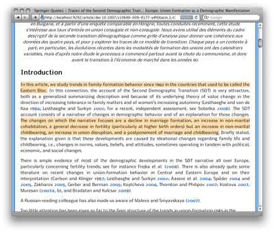
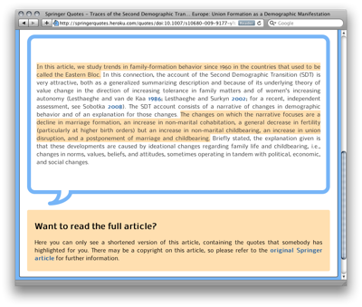

# Springer Quotes

This is the source code for [Springer Quotes](http://springerquotes.heroku.com/),
the application with which [I won the 1st prize][challenge] in the Springer API Challenge 1.0

I am open sourcing this code, so that others can take some bits and pieces that they need. Also this seems like the right thing to do, as I have used some many open source tools (as you will see later).

## Highlights

There are two interesting pieces to this application that I want to highlight:

* It uses the [Emphasis JavaScript Library](https://github.com/NYTimes/Emphasis) for the quote selection effect in the UI. I have ported the Javascript code to ruby as well, for use as the server side counter part (see `./emphasis` folder). 
* It uses XSLT to transform Springer's A++ XML format, as returned by the Springer API, into XHTML that can be used for the web. 

## Tools used

Besides this source code, these are the tools and services that I used to build Springer Quotes:
	
<ul>
	<li><a href="http://heroku.com">heroku</a> for hosting this site</li>	
	<li><a href="http://couchone.com">CouchDB</a> for the data storage</li>	
	<li><a href="http://www.ruby-lang.org/en/">Ruby</a> and <a href="http://www.sinatrarb.com/">Sinatra</a> for the implementation and server DSL</li>	
	<li><a href="http://bit.ly">bit.ly</a> for shortening the links</li>	
	<li><a href="http://nokogiri.org/">Nokogiri</a> + XSLT for the conversion of Springer's A++ format into somewhat more readable HTML.</li>
	<li><a href="http://www.mathjax.org">MathJax</a> for beautifying mathematic formulas</li>
	<li><a href="http://imakewebthings.github.com/jquery-waypoints/sticky-elements/">'Sticky'</a> buttons at the top of the article</li>	
	<li><a href="http://nicolasgallagher.com/pure-css-speech-bubbles/">Pure CSS speech bubbles</a> for the nice speech bubbles you see on the /quotes page</li>
	<li><a href="http://jquery.com">jQuery</a> as my JavaScript library of choice</a></li>
</ul>

## Prerequisites 

Before you can run this application you will need a couple of things:

- ruby 1.8.7
- your own CouchDB
- [Springer API keys](http://dev.springer.com)
- (optionally) a bit.ly account 

Once you have these, you need to modify the configuration file `environment_variables.rb` accordingly.

## Installation

1. `bundle`
1. `bundle exec rackup`
1. Springer Quotes is now running at `http://localhost:9292`

Test the application by visiting the following URLs:
[normal article view](http://localhost:9292/article/doi:10.1007/s10680-009-9177-y#h[Itacin,1,4]), 
[quotes view](http://springerquotes.heroku.com/quotes/doi:10.1007/s10680-009-9177-y?quotes=h[Itacin,1,4])

If you should have any issues getting this to work, you can ping me [@sebastianspier][@seb] and I will try to help you out.

[@seb]: https://twitter.com/#!/sebastianspier
[challenge]: http://spier.hu/2011/07/i-won-the-springer-api-challenge-1.0/